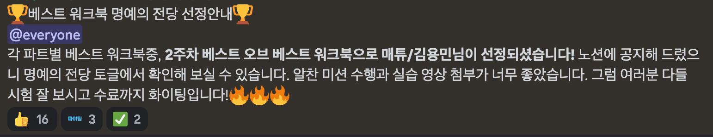

# 2주차 베스트 워크북 선정 👑

---

## 2주차 베스트 워크북 회고!

2주차 베스트 워크북에 선정되었습니다 👏👏👏👏

1주차떄 나름 열심히 워크북을 작성했는데, 당첨되지 않아 아쉬웠는데
1주차 때 ios파트에서 하신 분의 워크북을 보았더니... 절로 납득하게 되었습니다.

그래서 개인적으로 어떻게 해야 베스트 워크북에 선정이 될 수 있을까? 고민을 했다가, 개념적인 내용은 사실 다들 검색하면서 잘 찾아오기 때문에, 개인적으로 만드는 실습 과제에서 조금 차이점을 만들어 볼려고 노력했습니다.

이번 실습 과제는 기존에 만들었던 HTML, CSS로만 제작했던 넷플릭스 페이지를, JS 즉, 동적인 기능을 추가하는 것입니다.

음... 기존에 1주차 때 얼마없는 넷플릭스의 동적인 기능을 CSS로 구현한 탓에 JS로 만들것이 없기떄문에 기존에 없던 기능을 추가하고, 이전에 넷플릭스 홈페이지 때 사용했던 Navigation을 만들어보자가 저의 결론이였습니다.

---

### 내가 만든 새로운 넷플릭스 홈페이지에 추가한 JS!

1. Auto type effect + speed control (input요소를 제어해서 타이핑하는 효과 집어넣기)
2. Left Navbar 넷플릭스의 주요 색상인 (빨강색, 흰색, 검정색을 활용하여 Navbar를 만듬!)
3. Hidden Toggle Search 구현! (나름의 디자인 포함…)

---

### 선정과정 ✅

사실 베스트워크북 선정 전에 먼저 조에서 먼저 우수 워크북을 고릅니다! 사실 팀장인 내가 골라도 되는 건데, 그래도 다같이 고르는 것이 좋은 것 같아서 기간까지 워크북 완성을 확인하고, 카카오톡 방으로 서로의 워크북을 확인하고 투표 하는 것으로 우리 조 끼리는 정했다! 1주차, 2주차 모두 내가 선정 되었고 이번에 베스트 워크북이 되어서 뿌듯했다!

---

### 비전공자로서 두려움 ⁇

이번에 UMC 합격자를 봤을떄 경영학부 단일전공인 사람은 나밖에 없고, PM제외 개발 파트 중에서 유일한 순수 문과였던걸로 기억한다. 물론 다른 경영학부생들도 있었지만 컴퓨터 관련학과 복수전공생이였다. 솔직하게 개인적으로 혼자 강의를 듣고, 책을 보며 공부를 했기에 내가 지금 다른 컴퓨터 전공생들 중에 어느 정도 실력에 해당할까를 확인하는게 어려웠다. 이번에 같이 공부를 해보며 어짜피 전공생 친구들도 개발에 관련한 공부를 이제 시작하거나, 얼마 공부를 안했기 떄문에 오히려 내가 앞서나갈 수도있다고 생각했다. 사실 제대로 개발 공부를 시작한지는 3개월도 되지않았다. 경영학부 수업과 같이 준비하는 것은 쉽지 않지만, 그래도 개발 공부를 주로하면서 나중에 뛰어난 개발자가 되고 싶다.

---

### 앞으로의 스터디 진행방향, 공부 계획

사실 지금, 시험기간이라 아직 나의 본질은 경영학부생이기 떄문에 아예 공부를 하지 않을 수 없기에 조금이라도 하고 있다. 개발에 온전히 모든 시간을 활용하는 것은 불가능하다. 그래도 하루 1커밋을 의미있는 내용으로 하기 위해 노력하고 있고, 지금 시험기간이기에 스터디도 이제 하지 않고, 아마 4/27(목) 부터 다시 진행할 것 같다. 스터디를 통해 기존에 알고 있었던 내용을 재정리하고, 몰랐던 내용은 팀원들과 서로 공유하며 배우는 시간을 갖고 싶고, 지금 `react`까지 1회독을 했고, 이제 `TypeScript`와, `GitHub`에 대해서 공부를 시작했다. 시험 기간 후에, 기존에 배웠던 `JS`, `React`를 복습하며 새로운 지식들을 학습해보는 시간을 갖고 싶다.

추후에는 `Next.js` `Node.js` 에 대해서 학습해보며, 프론트엔드 백엔드 모든 지식도 알고 싶고 비전공자이기에 `CS` 에 대한 학습 그리고 방학떄 기업에서 하는 좋은 활동들에 참여해보고 싶기에 `코딩테스트` 또한 `JS`로 준비할 생각이기에 열심히 삶을 살아보고 싶다.

**UMC 활동에 대해 궁금하신 점이 있다면 아래 `댓글`로 남겨주세요!👇**
