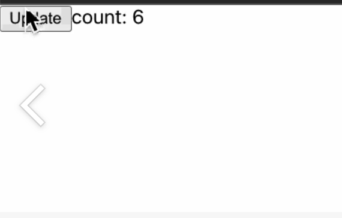

# useEffect에 대해 알아보자!

<span style="background-color:yellow">useEffect</span>란 어떠한 컴포넌트가 Mount되었을떄 Update될때 UnMount되었을 떄 특정 작업을 처리할 코드를 실행시켜주고 싶을떄 사용하면 된다.

<span style="background-color:yellow">useEffect</span>는 콜백함수를 인자로 전달받습니다.

1. useEffect의 인자로 하나의 콜백함수만 받을때!

```js
useEffect(() => {// 작업...})
```

렌더링 될 때마다 실행됩니다.

2. useEffect의 첫번쨰 인자로 콜백함수와, 두번쨰 인자로 dependency array를 받는 경우.

```js
useEffect(() => { // 작업 ... }, [value])
```

화면에 첫 렌더링 될떄 실행, value 값이 바뀔때 마다 실행!

### 자주 쓰는 경우

Clean Up - 정리 할떄 useEffect의 리턴 값으로 함수를 넣어주면 됩니다.

구독할 경우, 구독을 해지 해 주는 정리 작업을 해주어야 합니다. 타이머를 실행했다면, 타이머를 멈추는 정리 작업, eventListener를 등록했다면 이것을 정리해주는 정리작업도 필요. 이런 경우에는 <span style="background-color:yellow">useEffect</span>의 리턴 값으로 함수를 넣어주면 된다.

```js
// 구독해지 코드 예시
useEffect(() => {
  // 구독...
  return () => {
    // 구독 해지
  };
}, []);
```

### 예제

먼저 아래 이미지와 같이 버튼을 누르면 카운트를 해주는 컴포넌트를 구성해보겠습니다.


```js
function App() {
  const [count, setCount] = useState(1);
  const handleCountUpdate = () => {
    setCount(count + 1);
  };
  return (
    <>
      <button onClick={handleCountUpdate}>업데이트</button>
      <span>카운트 횟수: {count}</span>
    </>
  );
}

export default App;
```

위의 코드에 우리가 렌더링 될떄마다 <span style="background-color:yellow">useEffect</span>가 실행되는지 한번 확인해 보겠습니다.


```js
import { useState, useEffect } from 'react';

function App() {
  const [count, setCount] = useState(1);
  const handleCountUpdate = () => {
    setCount(count + 1);
  };
  // 매번 렌더링 될 떄마다 실행됩니다.
  useEffect(() => {
    console.log('렌더링된당.');
  });
  return (
    <>
      <button onClick={handleCountUpdate}>업데이트</button>
      <span>카운트 횟수: {count}</span>
    </>
  );
}

export default App;
```

이번에는 input창을 받아와서 우리가 입력한 것을 그대로 화면에 출력해주는 것을 만들어서, 렌더링여부를 확인해 보겠습니다.

// 렌더링 이미지 (글씨 포함)

useEffect 함수를 매번 렌더링이 될 때마다 불리게 된다면 정말 비효율 적이란 것을 확인할 수 있다. 우리가, name이 업데이트 되었을 때는 렌더링이 되지않고, count가 업데이트 되었을 때만 렌더링이 되도록 실행하고 싶으면 [] dependency array를 이용하면 된다. [count]라고 해보고 코드를 실행해보자

```js
useEffect(() => {
  console.log('렌더링된당.');
}, [count]);
```

;; 카운트 시에만 렌더링 되는 이미지

잘 작동되는 것을 확인할 수 있다. 특정한 행위일떄만 렌더링 되고싶으면 []에 원하는 행위의 값을 넣어주면 된다.

```js
useEffect(() => {
  console.log('그냥 다 렌더링');
});

useEffect(() => {
  console.log('카운트가 변경되어 렌더링');
}, [count]);

useEffect(() => {
  console.log('이름이 변경되어 렌더링');
}, [name]);
```

이 코드를 추가하고 실행결과를 확인해보자.

~ 모두다 바뀌는 useEffect 이미지

### cleanUp 예제

타이머 컴포넌트를 만들어 예시로 사용해보겠습니다.
버튼을 누르면 타이머가 실행되고, 콘솔에 2초마다 찍히도록 제작해보겠습니다.

```js
// Timer.jsx
import React, { useEffect } from 'react';

export const Timer = (props) => {
  useEffect(() => {
    const timer = setInterval(() => {
      console.log('타이머가 작동중입니다.');
    }, 1000);
  }, []);

  return (
    <>
      <span>타이머가 작동중입니다.</span>
    </>
  );
};
```

```js
// App.js
import { useState, useEffect } from 'react';
import { Timer } from './components/Timer';

function App() {
  const [showTimer, setShowTimer] = useState(false);
  return (
    <>
      // 타이머가 참일떄만 보여주고
      {showTimer && <Timer />}
      // 버튼 클릭시 반대의 상태로 변경
      <button onClick={() => setShowTimer(!showTimer)}>Toggle Timer</button>
    </>
  );
}

export default App;
```

... 타이머 이미지!

그러나 위의 코드에서는 문제점이 하나 있다. 타이머의 토글버튼을 눌러 실행시켜주지 않아도, 계속해서 타이머가 작동하는 것이다. 이 이유는 우리가 위에서 설명했듯이 타이머를 종료하는 Clean Up 함수를 리턴값으로 주지 않아서 그렇다.

즉, 아래와 같이 다시 설정해주어야 한다.

```js
import React, { useEffect } from 'react';

export const Timer = (props) => {
  useEffect(() => {
    const timer = setInterval(() => {
      console.log('타이머가 작동중입니다.');
    }, 1000);
    return () => {
      clearInterval(timer);
      console.log('타이머 종료!');
    };
  }, []);

  return (
    <>
      <span>타이머가 작동중입니다.</span>
    </>
  );
};
```

콘솔에 타이머가 종료되었습니다가 찍히고 시작하는 경우가 있다. 이는 리액트 버전 업데이트가 되면서 strictMode 관련 문제이다. App.js를 감싸는 엄격한 모드를 제거해주면 정상 작동함을 확인할 수 있습니다.

**useEffect에 대해 궁금하신 점이 있거나 위의 내용 중 수정해야할 내용이 있을시에 아래 `댓글`로 남겨주세요!👇**
